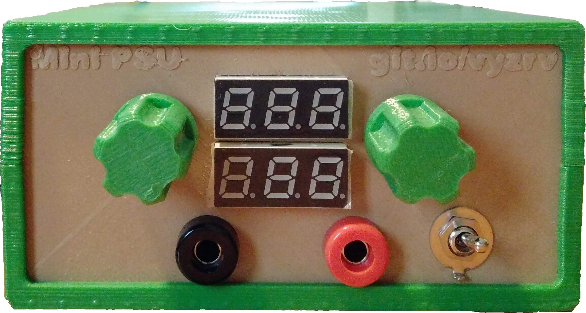
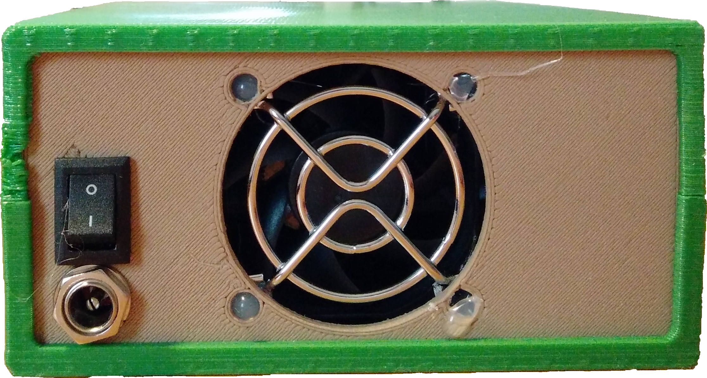
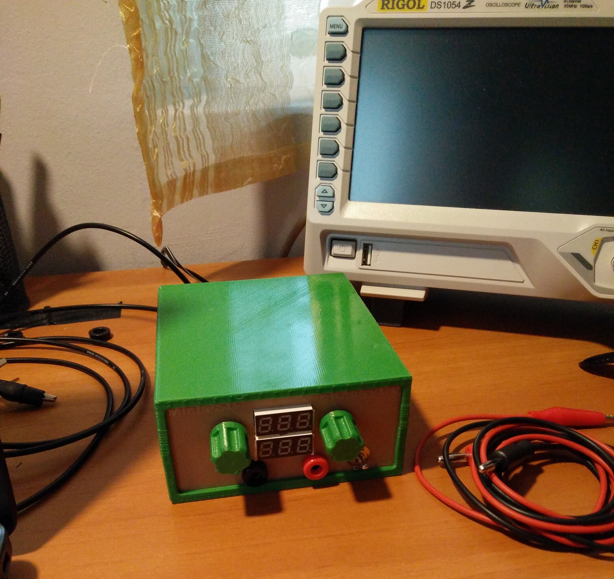

# Open-Source-Power-Supply
An open source benchtop power supply that's good enough for most purposes.

The case was **3D printed** using a [Monoprice Select Mini](https://www.monoprice.com/product?p_id=15365) with wood PLA
for the front and back panels, and normal, green PLA for the top and bottom parts of the case.

The 3D design for the case was generated using [Heartman's Ultimate Box Maker](http://www.thingiverse.com/thing:1264391).

## Characteristics
- **Input Voltage:** up to 19V without fan
- **Output Voltage:** 0-12V
- **Output Current:** 0-600mA (see Note)
- Adjustable current limit

**Note:** current can go up to 800mA by repacing the five 10 Ohm resistors with 5 Ohm resitors and,
optionally, choosing a different gain for the differencial amplifier.

